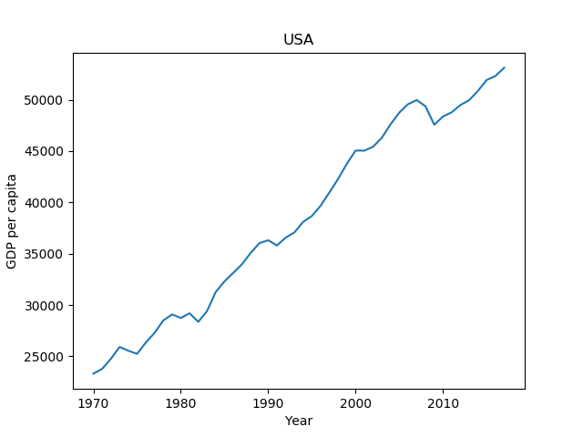
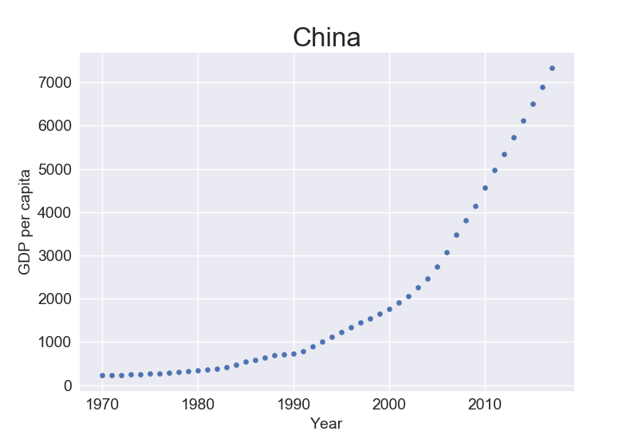

# Data-analysis
Data analysis with Python

`c.py`

GDP per capita of the US from 1970 until now.



`d.py`




Virtual environment
```
python -m venv venv_name
venv_name\Scripts\activate
deactivate
rmdir venv_name /s
pip freeze ==> save it to a .txt
pip install -r requirements.txt
```
